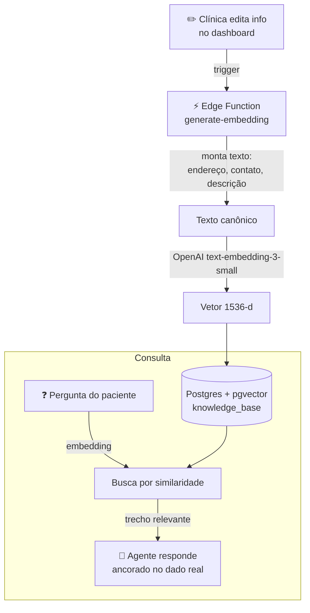

# 🧠 Base de Conhecimento com Busca Semântica (RAG)

> Pipeline de **RAG** que transforma as informações da clínica (preços, procedimentos, endereço, protocolos) em **embeddings vetoriais**, para o agente de IA responder com informação **real** — não inventada.

> 🔒 **Case anonimizado.** Sem nome de cliente, credenciais ou dados reais. (Nomes de tabela/campo são ilustrativos.)

---

## 🎯 O problema

Um LLM sozinho **alucina**: inventa preço, inventa endereço, promete o que a clínica não faz. Para um negócio, isso é perigoso — gera frustração e quebra de confiança.

O agente precisa responder com base **só no que aquela clínica realmente oferece**, e cada clínica tem informação diferente.

## ✅ A solução

Um pipeline de **Retrieval-Augmented Generation**:

1. A clínica cadastra suas informações (localização, endereço, procedimentos, contato, descrição).
2. Cada registro é **vetorizado** (embeddings) e guardado no Postgres com `pgvector`.
3. Quando o paciente pergunta algo, o agente faz uma **busca semântica** e injeta o trecho relevante no prompt.
4. A IA responde **ancorada** na informação real.

---

## 🏗️ Arquitetura

### O fluxo de embedding

- Uma **Edge Function** (Deno/Supabase) recebe o `id` do registro e o **schema** da clínica.
- Monta um **texto canônico** concatenando os campos relevantes (endereço, ponto de referência, contato, site e descrição).
- Gera o embedding com o modelo `text-embedding-3-small` da OpenAI.
- Grava o vetor + o texto + **metadados** (modelo usado, timestamp, tamanho do conteúdo) na tabela.
- Tudo isolado por **schema** — cada clínica tem o seu, com uma allowlist validando o acesso.

---

## 🧩 Destaques técnicos

- **Multi-tenant por schema:** o mesmo pipeline serve N clínicas; o `schema` chega na requisição e é validado contra uma allowlist (nada de injeção de schema arbitrário).
- **Validação rígida de entrada:** `recordId` precisa ser UUID válido, schema precisa estar na allowlist — falha cedo e claro.
- **Composição inteligente do texto:** só os campos preenchidos entram no embedding (campos vazios são filtrados), melhorando a qualidade da busca.
- **Metadados versionáveis:** cada vetor guarda o modelo e a data de vetorização — permite re-embeddar quando trocar de modelo.
- **CORS configurável** por variável de ambiente (allowlist de origens).
- **Service role isolado:** a função usa a service key só no servidor, nunca expõe ao cliente.

## 🧰 Stack

| Camada | Tecnologia |
|---|---|
| Vetorização | OpenAI `text-embedding-3-small` (1536-d) |
| Armazenamento vetorial | Postgres + `pgvector` (Supabase) |
| Compute | Supabase Edge Function (Deno) |
| Isolamento | Schema-per-tenant + allowlist |

## 📈 Resultados

- 🎯 **Respostas ancoradas no dado real da clínica** — corta a alucinação (preço/endereço inventado).
- 🔄 **Clínica nova entra rápido**: cadastra a info → o agente já responde sobre ela.
- 📚 Mais dúvidas resolvidas sem escalar pra um humano.

<!-- iTristaoo: se tiver número real, some aqui (ex: "X% menos respostas escaladas"). Não invente. -->

---

## 🔗 Projetos relacionados

- [ai-receptionist-clinics](https://github.com/iTristaoo/ai-receptionist-clinics) — o agente que consome esta base
- [ai-followup-automation](https://github.com/iTristaoo/ai-followup-automation) — usa esta base ao gerar as mensagens de reativação
- [multitenant-clinic-dashboard](https://github.com/iTristaoo/multitenant-clinic-dashboard) — onde a clínica edita o conteúdo que vira embedding

---

## 📲 Quer um agente desses no seu negócio?

**Construo automações e agentes de IA sob medida.** Bora conversar — me chama.

<!-- iTristaoo: troque pelos seus links reais → ex: [WhatsApp](https://wa.me/55SEUNUMERO) · [Email](mailto:seu@email.com) -->
